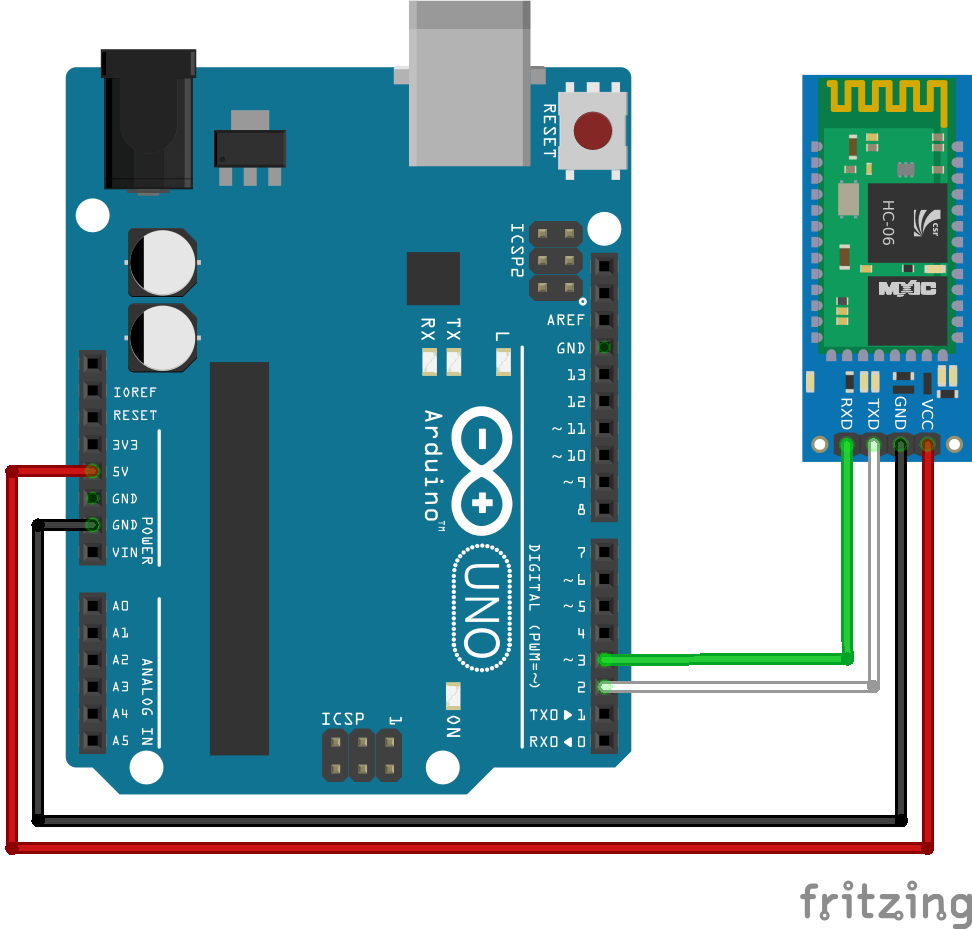

# Simple Bluetooth Socket for communication with Arduino HC05, HC06

  

## Procedure for Arduino:
1. Connect HC06 Bluetooth module as illustrated in schematics above.  
2. Upload this code snippet to Arduino IDE sketch.

``` arduino
/* BLESocketSketch.ino */

#include <SoftwareSerial.h>
SoftwareSerial hc06(2, 3);
byte receivedData;

void setup() {
  hc06.begin(9600); // password is 0000
}

void loop() {
  // check if HC06 is available
  if (hc06.available()) {
    // if text arrived from Bluetooth HC06 serial...
    receivedData = hc06.read();
    // if symbol is "0" (ASCII)
    if (receivedData == 48)
    {
      // send alphabet
      for (int i = 65; i <= 90; i++) {
        hc06.print((char)i);
        delay(50);
      }
    }
  }
  delay(200);
}
``` 

## Procedure for Android:

1. Define necessary Bluetooth permissions in Manifest.
2. Declare physical Mac address of Bluetooth device to connect.
3. Get a handle to the default local `BluetoothAdapter`. Connect to remote device.
4. Initialize `BluetoothSocket` for communication.
5. Send "0" symbol to the socket.
6. Receive input stream from Bluetooth socket.
7. Don't forget to close `BluetoothSocket` after completion.
8. Display results with `Logcat` of Android.