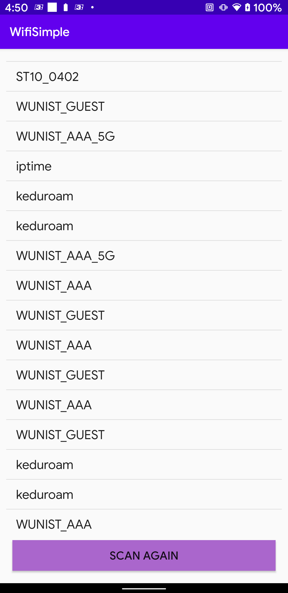

# Simple WiFi scanner

## Procedure:

1. Declare permissions in `Manifest`.
2. Request `permissions` at runtime.
3. Get a handle to the default WiFi service with `WifiManager`.
4. Register `BroadcastReceiver` and start the scanning process.
5. Get scan results & unregister `BroadcastReceiver`.